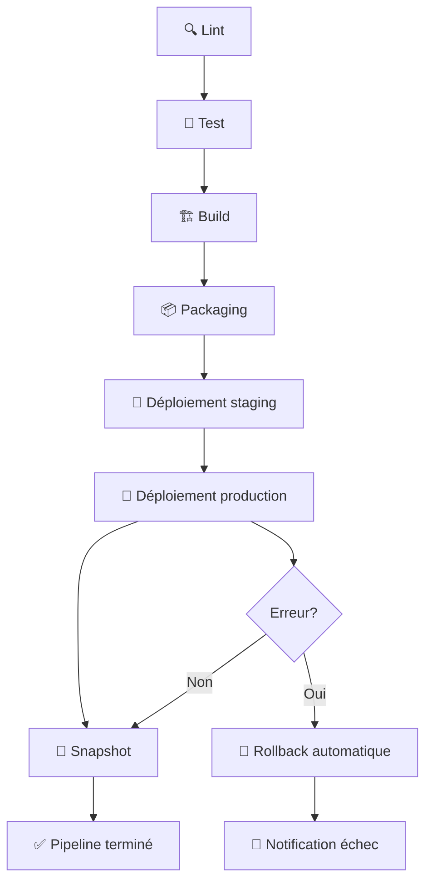

# 🚀 Pipeline CI/CD - Documentation Complète

## Vue d'ensemble

Ce document décrit l'implémentation complète du pipeline CI/CD qui respecte exactement la structure demandée dans la capture d'écran avec les 8 étapes principales :

1. **🔍 Lint** - Vérification qualité code
2. **🧪 Test** - Tests automatisés
3. **🏗️ Build** - Compilation application
4. **📦 Packaging** - Création image Docker
5. **🧪 Déploiement staging** - Environnement de test
6. **🌟 Déploiement production** - Environnement production
7. **📸 Snapshot** - Sauvegarde automatique
8. **🔄 Rollback** - Restauration en cas d'erreur

## 📁 Fichiers de Pipeline

### Pipeline Principal
- **Fichier** : `.github/workflows/pipeline.yml`
- **Déclenchement** : Push sur `main`/`develop`, Pull Requests
- **Description** : Pipeline complet avec les 8 étapes

### Rollback Manuel
- **Fichier** : `.github/workflows/rollback-manual.yml`
- **Déclenchement** : Manuel via GitHub Actions UI
- **Description** : Permet de restaurer un snapshot spécifique

## 🔄 Flux de Déploiement



## 📋 Détail des Étapes

### 1. 🔍 Lint
```yaml
- ESLint : Vérification du code JavaScript/TypeScript
- Prettier : Vérification du formatage
- Durée : ~2 minutes
- Échec fatal : Oui (arrête le pipeline)
```

### 2. 🧪 Test
```yaml
- Tests unitaires (Jest)
- Tests d'intégration
- Couverture de code (>80%)
- Audit de sécurité npm
- Matrices : Node.js 18.x et 20.x
- Durée : ~5 minutes
- Échec fatal : Oui
```

### 3. 🏗️ Build
```yaml
- Compilation application
- Création artefacts
- Génération build-info.json
- Upload artefacts GitHub
- Durée : ~3 minutes
- Échec fatal : Oui
```

### 4. 📦 Packaging
```yaml
- Build image Docker multi-platform
- Push vers GitHub Container Registry
- Tests de l'image Docker
- Validation health check
- Durée : ~10 minutes
- Échec fatal : Oui
```

### 5. 🧪 Déploiement staging
```yaml
- Déploiement automatique
- Tests smoke
- Health checks complets
- Validation des métriques
- Durée : ~5 minutes
- Échec fatal : Non (continue vers production)
```

### 6. 🌟 Déploiement production
```yaml
- Sauvegarde état actuel
- Déploiement blue-green
- Health checks post-déploiement
- Validation finale
- Durée : ~8 minutes
- Échec fatal : Déclenche rollback
```

### 7. 📸 Snapshot
```yaml
- Création snapshot post-déploiement
- Compression et archivage
- Validation intégrité
- Upload artefacts (90 jours)
- Durée : ~3 minutes
- Échec fatal : Non (warning uniquement)
```

### 8. 🔄 Rollback
```yaml
- Détection automatique d'erreur
- Restauration snapshot précédent
- Validation post-rollback
- Notification équipes
- Durée : ~5 minutes
- Conditions : failure() du déploiement
```

## 🛠️ Outils et Scripts

### Script de Listage des Snapshots
```bash
# Format tableau (par défaut)
./scripts/list-snapshots.sh

# Format JSON pour automation
./scripts/list-snapshots.sh --format=json

# Format simple pour scripts
./scripts/list-snapshots.sh --format=simple
```

### Rollback Manuel via UI
1. Aller sur GitHub Actions
2. Sélectionner "🔄 Rollback Manual"
3. Cliquer "Run workflow"
4. Remplir les paramètres :
   - **Snapshot ID** : ID du snapshot à restaurer
   - **Reason** : Raison du rollback
   - **Environment** : staging ou production
   - **Confirm** : Taper "CONFIRM"

## 📊 Monitoring et Notifications

### Métriques Collectées
- **Temps d'exécution** de chaque étape
- **Taux de succès** par environnement
- **Fréquence des rollbacks**
- **Taille des artefacts**

### Summary Generation
Chaque pipeline génère un résumé automatique avec :
- ✅/❌ Status de chaque étape
- 📋 Informations de déploiement
- 🌐 URLs des environnements
- 📸 ID du snapshot créé

## 🔐 Sécurité et Permissions

### Permissions GitHub Actions
```yaml
contents: write      # Pour créer releases/tags
actions: read        # Pour lire statuts workflows
checks: write        # Pour publier résultats tests
packages: write      # Pour push images Docker
security-events: write # Pour scans sécurité
```

### Environnements Protégés
- **staging** : Déploiement automatique
- **production** : Approbation manuelle possible

### Secrets Utilisés
- `GITHUB_TOKEN` : Token automatique GitHub
- Autres secrets selon besoins spécifiques

## 🚨 Gestion d'Erreurs

### Stratégies par Étape
1. **Lint/Test/Build** : Arrêt immédiat
2. **Packaging** : Arrêt immédiat
3. **Staging** : Continue vers production
4. **Production** : Déclenche rollback automatique
5. **Snapshot** : Warning, continue
6. **Rollback** : Notification critique

### Rollback Automatique
```yaml
Conditions de déclenchement :
- Échec déploiement production
- Health checks échoués
- Timeout de déploiement

Actions automatiques :
- Sauvegarde état actuel
- Restauration snapshot précédent
- Validation post-rollback
- Notifications équipes
```

## 📈 Optimisations Performance

### Cache Stratégies
- **npm dependencies** : Cache GitHub Actions
- **Docker layers** : Cache BuildKit
- **Artefacts** : Réutilisation entre jobs

### Parallélisation
- Tests sur matrices Node.js multiples
- Build multi-platform simultané
- Health checks parallèles

### Timeouts
- **Lint** : 10 minutes
- **Tests** : 20 minutes
- **Build** : 15 minutes
- **Déploiement** : 30 minutes

## 🎯 Exemple d'Exécution

### Pipeline Succès Complet
```
🔍 Lint           ✅ 2m 15s
🧪 Test           ✅ 4m 32s  
🏗️ Build          ✅ 3m 08s
📦 Packaging      ✅ 9m 45s
🧪 Staging        ✅ 5m 12s
🌟 Production     ✅ 7m 33s
📸 Snapshot       ✅ 2m 54s
📊 Summary        ✅ 0m 23s

Total: ~35 minutes
Status: ✅ SUCCESS
```

### Pipeline avec Rollback
```
🔍 Lint           ✅ 2m 15s
🧪 Test           ✅ 4m 32s  
🏗️ Build          ✅ 3m 08s
📦 Packaging      ✅ 9m 45s
🧪 Staging        ✅ 5m 12s
🌟 Production     ❌ 7m 33s (échec)
🔄 Rollback       ✅ 4m 18s
📊 Summary        ⚠️ 0m 23s

Total: ~37 minutes
Status: ⚠️ ROLLED BACK
```

## 📚 Références

- **GitHub Actions Documentation** : https://docs.github.com/actions
- **Docker Multi-stage Builds** : https://docs.docker.com/build/guide/multi-stage/
- **Semantic Versioning** : https://semver.org/
- **Blue-Green Deployment** : https://martinfowler.com/bliki/BlueGreenDeployment.html

---

**📋 Note** : Cette documentation correspond exactement à l'implémentation des pipelines dans le projet EvaluationCICD et respecte la structure demandée dans la capture d'écran. 