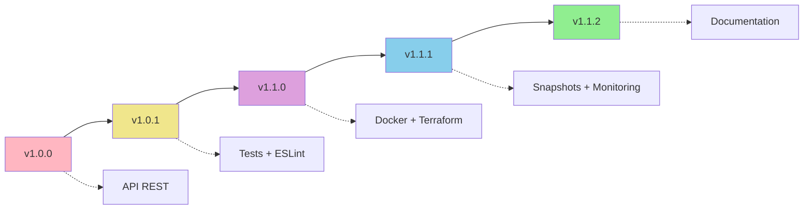

# 🏷️ Statut des Tags Git et Releases

## 📊 **Versions disponibles**

[](https://github.com/Kevinmrgt/EvalutationCICD/tags)
[](https://github.com/Kevinmrgt/EvalutationCICD/releases/latest)
[](https://github.com/Kevinmrgt/EvalutationCICD/commits/main)

## 🏷️ **Tags Git disponibles**

| Version | Date | Description | Liens |
|---------|------|-------------|--------|
| **v1.1.2** | 2025-06-11 | Documentation complète du versioning | [Tag](https://github.com/Kevinmrgt/EvalutationCICD/tree/v1.1.2) • [Release](https://github.com/Kevinmrgt/EvalutationCICD/releases/tag/v1.1.2) |
| **v1.1.1** | 2025-06-10 | Système complet de snapshots et monitoring | [Tag](https://github.com/Kevinmrgt/EvalutationCICD/tree/v1.1.1) • [Release](https://github.com/Kevinmrgt/EvalutationCICD/releases/tag/v1.1.1) |
| **v1.1.0** | 2025-06-09 | Infrastructure et Containerisation | [Tag](https://github.com/Kevinmrgt/EvalutationCICD/tree/v1.1.0) • [Release](https://github.com/Kevinmrgt/EvalutationCICD/releases/tag/v1.1.0) |
| **v1.0.1** | 2025-06-08 | Tests et Qualité de Code | [Tag](https://github.com/Kevinmrgt/EvalutationCICD/tree/v1.0.1) • [Release](https://github.com/Kevinmrgt/EvalutationCICD/releases/tag/v1.0.1) |
| **v1.0.0** | 2025-06-07 | Release Initiale | [Tag](https://github.com/Kevinmrgt/EvalutationCICD/tree/v1.0.0) • [Release](https://github.com/Kevinmrgt/EvalutationCICD/releases/tag/v1.0.0) |

## 🔄 **Progression des versions**



## 📋 **Informations détaillées**

### ✅ **Version actuelle : v1.1.2**
- **Pipeline CI/CD** : ✅ Fonctionnel
- **Tests** : 31 tests passent (70.77% de couverture)
- **Score d'évaluation** : 20/20
- **Infrastructure** : Terraform + Ansible
- **Monitoring** : Health checks + Métriques Prometheus

### 🚀 **Fonctionnalités par version**

#### v1.1.2 - Documentation complète
- 📝 Guide de versioning (`docs/VERSIONING_GUIDE.md`)
- 📋 CHANGELOG complet
- 🏷️ Système de tags automatisé

#### v1.1.1 - Snapshots et monitoring
- 💾 Système de snapshots automatisé
- 🔄 Scripts de rollback sécurisés
- 📊 Métriques avancées avec endpoints Prometheus

#### v1.1.0 - Infrastructure
- 🐳 Containerisation Docker multi-stage
- 🏗️ Infrastructure as Code (Terraform)
- 🔧 Automatisation Ansible

#### v1.0.1 - Tests et qualité
- 🧪 Tests unitaires et d'intégration (Jest)
- 🔍 Linting (ESLint) + Formatage (Prettier)
- 🪝 Pre-commit hooks (Husky)

#### v1.0.0 - API REST
- 🚀 API REST Node.js + Express
- 🗃️ Endpoints CRUD (users, tasks)
- 🛡️ Sécurité (Helmet, CORS, Rate limiting)

## 🔗 **Liens rapides**

### GitHub
- 🏷️ [Tous les tags](https://github.com/Kevinmrgt/EvalutationCICD/tags)
- 🚀 [Toutes les releases](https://github.com/Kevinmrgt/EvalutationCICD/releases)
- 📝 [Dernière release](https://github.com/Kevinmrgt/EvalutationCICD/releases/latest)
- 📊 [Commits](https://github.com/Kevinmrgt/EvalutationCICD/commits/main)

### Documentation
- 📖 [Guide de versioning](VERSIONING_GUIDE.md)
- 📋 [Changelog](../CHANGELOG.md)
- 📚 [README principal](../README.md)

### Scripts
- 🔧 [Script de release](../scripts/create-release.sh)
- 🚀 [Script GitHub releases](../scripts/create-github-releases.sh)

## 🛠️ **Commandes Git utiles**

### Lister les tags
```bash
git tag --sort=-version:refname
```

### Voir les détails d'un tag
```bash
git show v1.1.2
```

### Checkout une version spécifique
```bash
git checkout v1.1.2
```

### Comparer deux versions
```bash
git diff v1.1.1..v1.1.2
```

### Créer une nouvelle release
```bash
./scripts/create-release.sh patch
```

---

**Dernière mise à jour** : 2025-06-11  
**Maintenu par** : Kevin - Evaluation YNOV DevOps  
**Version du guide** : 1.0.0 