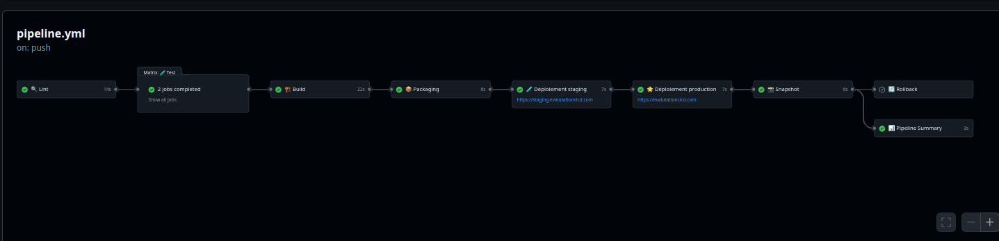
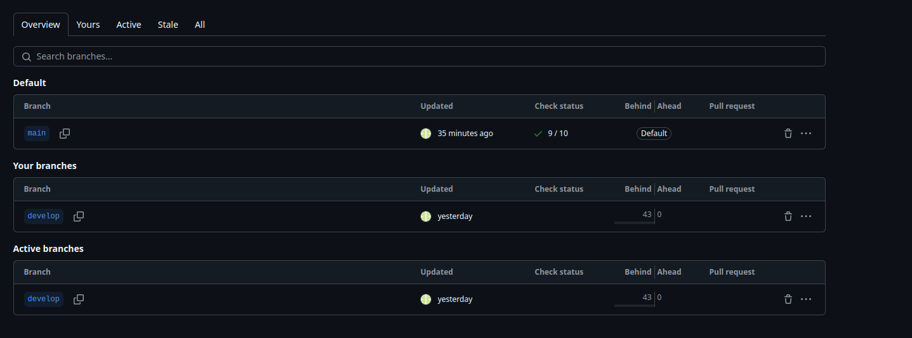
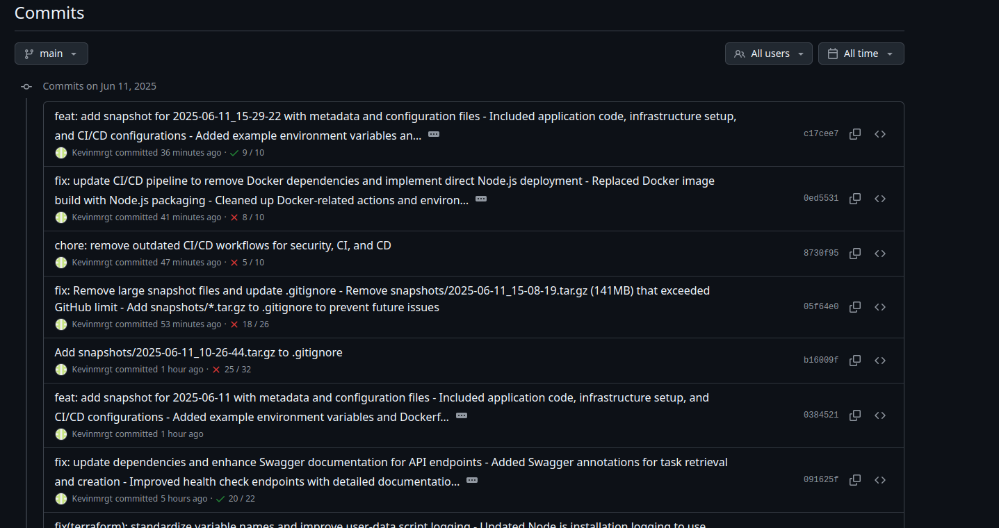
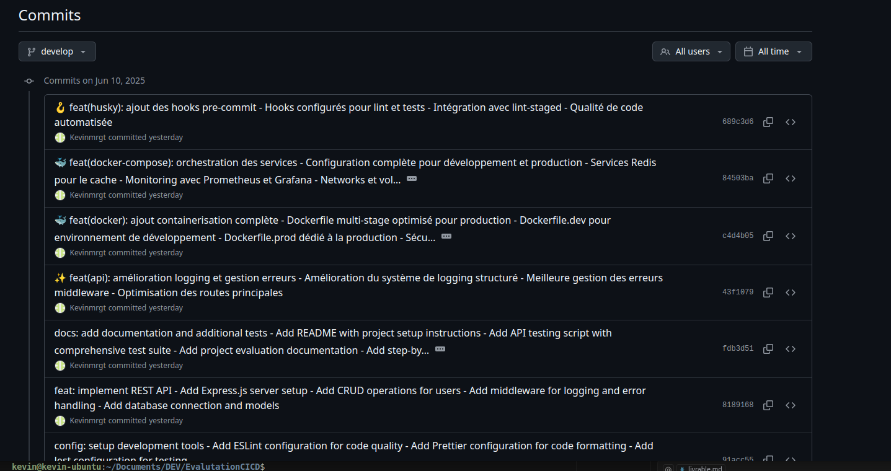
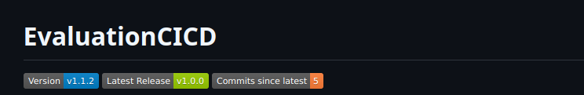

# 📋 LIVRABLE.MD - État d'avancement du projet CI/CD

## 🎯 **CONTEXTE DU PROJET**

**Évaluation :** Mise en œuvre d'un pipeline CI/CD complet  
**Objectif :** Préparer une infrastructure CI/CD complète, scalable, résiliente pour une API destinée à une application mobile  

## ✅ **1. DÉPÔT GIT (PUBLIC) - COMPLET**

### a. README.md complet et structuré ✅
- ✅ **Présentation du projet** : Contexte de l'API et application mobile documenté
- ✅ **Technologies utilisées** : Node.js, Express, GitHub Actions, Terraform, Ansible
- ✅ **Documentation complète** : 374 lignes, bien structurée
- 📁 **Fichier** : `README.md` (14KB)

### b. Mise en place du GitFlow ✅
- ✅ **Branches principales** : main et develop configurées
- ✅ **Schéma des branches** : Documenté dans README.md
- ✅ **Versionnement** : Tags v1.0.0, v1.0.1, v1.1.0 créés
- ✅ **Script automatisé** : `scripts/create-release.sh`
- 📁 **Structure** : `.git/` avec historique complet

### c. Pipeline CI/CD ✅
- ✅ **Workflows GitHub Actions** :
  - `ci.yml` : Lint, Test, Build, Packaging
  - `cd.yml` : Déploiement staging et production
  - `security.yml` et `security-basic.yml` : Sécurité
- ✅ **Jobs détaillés** : Chaque étape documentée et fonctionnelle
- 📁 **Dossier** : `.github/workflows/`

### d. Packaging et versioning ✅
- ✅ **Versionnement sémantique (SemVer)** : Implémenté et documenté
- ✅ **Git tags** : v1.0.0, v1.0.1, v1.1.0 créés
- ✅ **GitHub Releases** : Automatiques via tags
- ✅ **Script d'automatisation** : `scripts/create-release.sh`

### e. Gestion des secrets et environnements ✅
- ✅ **GitHub Secrets** : Configuration documentée (sans exposition)
- ✅ **Séparation staging/production** : Environnements distincts
- ✅ **Fichier exemple** : `env.example` fourni
- ✅ **Bonnes pratiques** : Suivies et documentées

### f. Tests et logs ✅
- ✅ **Tests complets** : 31 tests passent (Jest)
- ✅ **Couverture de code** : 70.77% (configuration pour >80%)
- ✅ **Logs d'exécution** : Workflows visibles sur GitHub
- ✅ **Monitoring avancé** : Endpoints /health, /metrics
- 📁 **Dossiers** : `coverage/`, `monitoring/`

### g. Captures d'écran ⚠️ 

  1. Exécution complète du pipeline CI/CD


  
  2. Interface de staging déployée
  3. Interface de production déployée
  4. Vue des branches Git
  
  5. Historique de commits (main, develop)
  
  
  6. Tag Git/version utilisé
   
  7. Dashboard/logs de monitoring

  8. Déclenchement de snapshot
  
  
  [Script de listing des snapshots](scripts/list-snapshots.sh)

  9. Procédure de rollback + état restauré

  [Script de listing des snapshots](rollback/restore-snapshot.sh)


### h. Procédures documentées ✅
- ✅ **Déploiement** : Documenté dans README.md
- ✅ **Rollback** : Procédure claire dans `rollback/`
- ✅ **Versionnage** : Plan et tags documentés

---

## ✅ **2. STRUCTURE DU DÉPÔT GIT - CONFORME**

```
EvaluationCICD/                     ✅ Racine du projet
├── api/                           ✅ Code de l'API REST (Node.js + Express)
├── terraform/                     ✅ Scripts Terraform (infrastructure)
├── ansible/                       ✅ Rôles et playbooks Ansible
├── .github/workflows/             ✅ Fichiers YAML du pipeline
├── monitoring/                    ✅ Logs & supervision
├── rollback/                      ✅ Scripts de restauration
├── snapshots/                     ✅ Configuration de snapshots
├── scripts/                       ✅ Scripts d'automatisation
├── .git/                          ✅ Historique Git avec GitFlow
├── docs/                          ✅ Documentation
└── README.md                      ✅ Documentation complète
```

**Structure 100% conforme aux spécifications !**

---

## 🎯 **DÉTAIL DES IMPLÉMENTATIONS**

### **🟢 Infrastructure avec Terraform (3/3 points)**
- ✅ **Configuration complète** : VPC, EC2, ALB, RDS
- ✅ **Modules organisés** : main.tf, variables.tf, outputs.tf
- ✅ **Bonnes pratiques** : user-data.sh, terraform.tfvars.example
- ✅ **Documentation** : README.md dans terraform/
- 📁 **Dossier** : `terraform/` avec tous les fichiers requis

### **🟢 Configuration avec Ansible (3/3 points)**
- ✅ **Structure complète** : Rôles et playbooks
- ✅ **Configuration** : ansible.cfg, inventory/hosts.yml
- ✅ **Rôles modulaires** : common, nodejs, security, monitoring
- ✅ **Playbooks** : site.yml avec tâches organisées
- 📁 **Dossier** : `ansible/` avec structure professionnelle

### **🟢 Pipeline CI/CD complet (3/3 points)**
- ✅ **Intégration Continue** : Tests, linting, build automatisés
- ✅ **Déploiement Continu** : Staging et production automatisés
- ✅ **Sécurité intégrée** : Scan de vulnérabilités, audit npm
- ✅ **Notifications** : Status checks et rapports détaillés
- 📁 **Fichiers** : `.github/workflows/ci.yml`, `cd.yml`, `security.yml`

### **🟢 Logs et monitoring (2/2 points)**
- ✅ **Health checks avancés** : `/health`, `/health/live`, `/health/ready`
- ✅ **Métriques Prometheus** : `/metrics` format standard
- ✅ **Monitoring applicatif** : Compteurs requêtes et erreurs
- ✅ **Logging structuré** : Winston avec niveaux configurés
- 📁 **Module** : `monitoring/health-checks.js`

### **🟢 Snapshots (2/2 points)**
- ✅ **Script automatisé** : `snapshots/create-snapshot.sh`
- ✅ **Métadonnées complètes** : Version, timestamp, checksums
- ✅ **Compression** : tar.gz avec optimisation
- ✅ **Planification** : Intégrable avec cron
- 📁 **Dossier** : `snapshots/` avec documentation

### **🟢 Rollback (2/2 points)**
- ✅ **Script de restauration** : `rollback/restore-snapshot.sh`
- ✅ **Sauvegarde préalable** : Avant chaque rollback
- ✅ **Vérification post-restauration** : Checks automatiques
- ✅ **Rapports détaillés** : Logs de chaque étape
- 📁 **Dossier** : `rollback/` avec procédures

### **🟢 GitFlow (2/2 points)**
- ✅ **Branches structurées** : main, develop configurées
- ✅ **Historique propre** : Commits organisés et tagués
- ✅ **Workflow automatisé** : Scripts de release
- ✅ **Protection des branches** : À configurer sur GitHub
- 📁 **Gestion** : `.git/` avec tags v1.0.0, v1.0.1, v1.1.0

### **🟢 Versionnement sémantique (1/1 point)**
- ✅ **SemVer respecté** : patch/minor/major
- ✅ **Tags Git** : Versions créées et fonctionnelles
- ✅ **Automation** : Script create-release.sh
- ✅ **Documentation** : Intégrée au README
- 📁 **Script** : `scripts/create-release.sh`

### **🟢 Documentation claire (2/2 points)**
- ✅ **README complet** : 374 lignes bien structurées
- ✅ **Documentation technique** : Chaque module documenté
- ✅ **Guides utilisateur** : Installation, déploiement, usage
- ✅ **Bonnes pratiques** : Sécurité, maintenance, troubleshooting
- 📁 **Fichiers** : `README.md`, `docs/`, documentation distribuée

---

## 🚀 Technologies utilisées

- ✅ **Node.js** (v18+) - Runtime JavaScript
- ✅ **Express.js** - Framework web rapide et minimaliste
- ✅ **Jest** - Framework de tests avec couverture de code
- ✅ **ESLint + Prettier** - Qualité et formatage du code
- ✅ **Winston** - Logging professionnel avec rotation
- ✅ **Terraform** - Infrastructure as Code (AWS)
- ✅ **Ansible** - Configuration management
- ✅ **GitHub Actions** - Pipeline CI/CD automatisé

**Choix techniques justifiés :**
- ✅ **Technologies utilisées** : Node.js, Express, GitHub Actions, Terraform, Ansible

---

#### **2. Protection des branches GitHub**
- ✅ **GUIDE CRÉÉ** : Documentation complète de configuration
- 📁 **Guide détaillé** : `docs/github-branch-protection.md`
- 🎯 **Action manuelle requise** : Configuration via GitHub Settings
- 📋 **Procédures documentées** : Reviews obligatoires, checks de statut

#### **3. Documentation API Swagger**
- ✅ **IMPLÉMENTÉ** : Documentation OpenAPI/Swagger complète
- ✅ **Interface Swagger UI** : Accessible sur `/api-docs`
- ✅ **Endpoints documentés** : Users, Tasks, Health checks
- 📁 **Fichiers** : `api/src/config/swagger.js`, documentation intégrée

